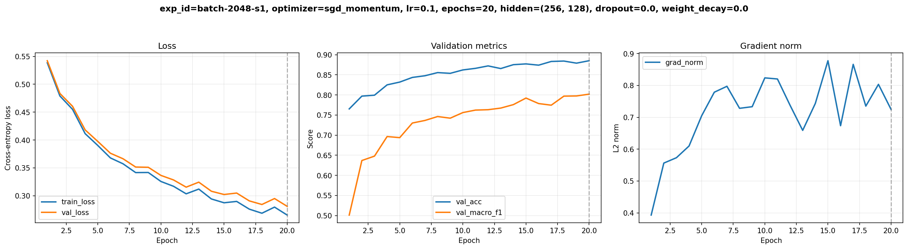
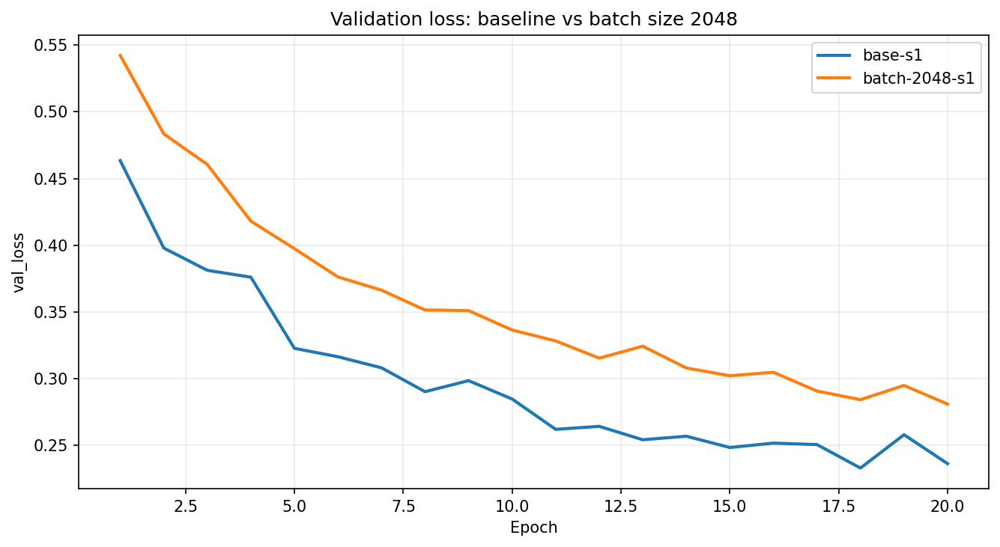
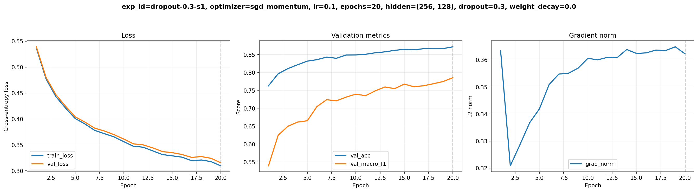
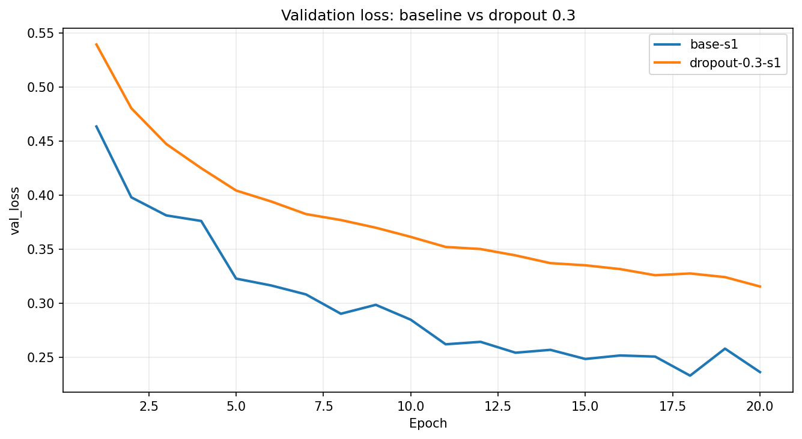
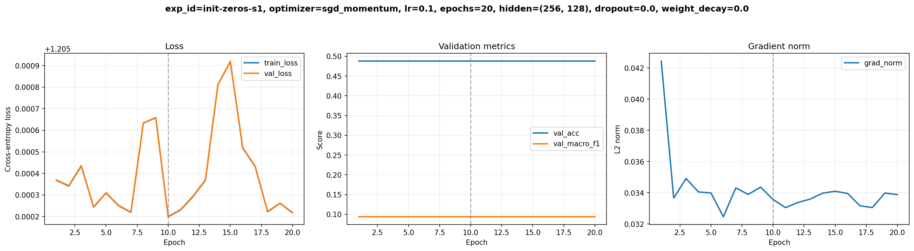
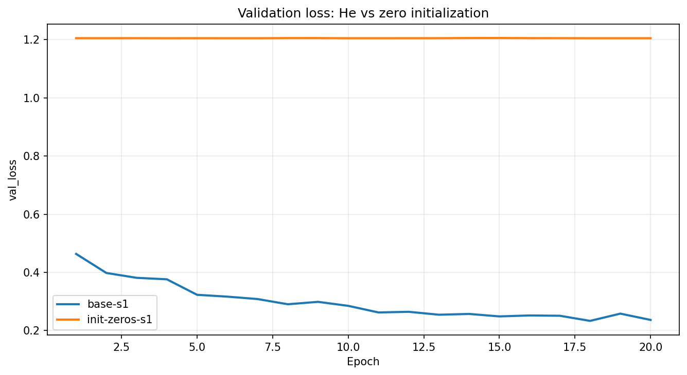

# Báo cáo Lab Day 1 — MSSV 2A202602819

## 1. Thiết lập

- Môi trường: notebook chạy trên Google Colab (`/content`). Phiên bản PyTorch và tên GPU không được lưu trong các artifact hiện có.
- Dữ liệu: Forest CoverType, train 464,809 mẫu, eval 116,203 mẫu theo `split_metadata.csv`. Tách validation phân tầng 20% từ train với seed 42: 371,847 mẫu train và 92,962 mẫu validation.
- Mô hình: M-base, 54→256→128→7, 47,879 tham số. Baseline dùng cross-entropy, SGD+momentum 0.9, lr=0.1, batch=512, 20 epoch, He initialization, không dropout, không clipping, FP32.
- Accuracy của dự đoán lớp đa số trên validation: khoảng 0.4876.
- Các chủ đề đã thử: hyper-parameter (batch size), dropout, khởi tạo tham số.

## 2. Kiểm tra ban đầu và độ nhiễu

| Kiểm tra | Kết quả |
|---|---:|
| Số tham số / logits | 47,879 / (B, 7) |
| Part 1 step-0 loss; so với ln(7)=1.9459 | 2.1984 |
| Overfit 20 mẫu: loss sau 500 bước | 0.00003475 |
| Gradient từng tham số ở phép thử ban đầu | Có gradient khác 0 |
| Baseline | 3 seed: `base-s1`, `base-s2`, `base-s3` |
| Val accuracy trung bình ± độ lệch chuẩn | 0.9097 ± 0.0024 |
| Val macro-F1 trung bình ± độ lệch chuẩn | 0.8543 ± 0.0119 |

Ngưỡng nhiễu tham khảo là 2σ = 0.0238 macro-F1 (và 0.0049 accuracy). Ngưỡng này được ước lượng từ ba seed baseline; số seed còn ít, nên các so sánh một seed cần được diễn giải thận trọng. `base-s1` có val loss thấp nhất ở epoch 18; `base-s2` và `base-s3` đạt val loss thấp nhất ở epoch 20. Đường loss nhìn chung giảm và train/validation loss tương đối gần nhau, chưa cho thấy overfitting lớn.

## 3. Kết quả theo chủ đề

### 3.1 Hyper-parameter: batch size

**Dự đoán:** tăng batch từ 512 lên 2048 sẽ giảm số cập nhật mỗi epoch còn khoảng một phần tư; với cùng 20 epoch, macro-F1 validation có thể thấp hơn do có ít lần cập nhật hơn.

Ở `batch-2048-s1`, số bước mỗi epoch giảm từ 727 xuống 182. Val macro-F1 đạt 0.8019 ở epoch 20, thấp hơn `base-s1` 0.0391, lớn hơn ngưỡng nhiễu 2σ = 0.0238; accuracy là 0.8850 so với 0.9069 của `base-s1`. Vì vậy dự đoán về macro-F1 thấp hơn được xác nhận và mức giảm lớn hơn dao động seed ước lượng. Thời gian trung bình mỗi epoch là 0.422 giây, so với 1.467 giây ở `base-s1` trong cùng các log; batch lớn giảm thời gian mỗi epoch ở lần đo này nhưng đổi lại có ít cập nhật hơn. Kết quả vẫn đang giảm val loss đến epoch 20, nên chưa thấy điểm dừng tối ưu theo epoch.

### 3.2 Dropout

**Dự đoán:** baseline chưa có dấu hiệu overfitting rõ, nên dropout 0.3 có thể không cải thiện macro-F1; khoảng cách train–validation loss có thể thu hẹp.

`dropout-0.3-s1` đạt val macro-F1 0.7853 và accuracy 0.8715 ở epoch 20, với best val loss 0.3156. Macro-F1 thấp hơn `base-s1` 0.0557, vượt ngưỡng 2σ = 0.0238. Ở epoch tốt nhất, train loss 0.3097 và val loss 0.3156, chênh 0.0059; ở epoch best-loss của `base-s1`, khoảng cách tương ứng khoảng 0.0193. Như vậy dropout thu hẹp khoảng cách loss nhưng không cải thiện metric validation. Điều này phù hợp với dự đoán rằng baseline không bị overfit đáng kể: giảm khoảng cách train–validation không đồng nghĩa tăng macro-F1. Thời gian trung bình mỗi epoch là 1.556 giây so với 1.467 giây ở `base-s1`; không thấy lợi ích về tốc độ trong lần đo này.

### 3.3 Khởi tạo tham số: zeros

**Dự đoán:** khởi tạo toàn bộ trọng số và bias bằng 0 khiến các hidden activation sau ReLU bằng 0, phá vỡ khả năng học biểu diễn do đối xứng giữa các neuron.

`init-zeros-s1` có activation std sau hai ReLU bằng `[0.0, 0.0]`, trong khi He cho `[0.3904, 0.3661]`. Step-0 loss = 1.94591, đúng bằng ln(7). Sau huấn luyện, macro-F1 validation là 0.0936 và accuracy 0.4876, gần mức dự đoán lớp đa số; macro-F1 thấp hơn `base-s1` 0.7473, vượt xa ngưỡng 2σ. Metric gần như không đổi suốt 20 epoch. Grad norm tổng vẫn khoảng 0.03 vì bias lớp đầu ra có thể nhận gradient và học lệch về lớp đa số; activation ẩn bằng 0 khiến các hidden layers không học được đặc trưng. Dự đoán về việc mô hình không học biểu diễn được xác nhận. Thời gian trung bình là 1.474 giây mỗi epoch, xấp xỉ `base-s1` trong lần đo này.

## 4. Đánh giá cuối trên tập eval

Cấu hình được chốt chỉ bằng validation: giữ baseline `base-s1`, seed 1, M-base với lr=0.1, batch=512, He, SGD+momentum 0.9, không dropout. Best epoch là 18, val loss = 0.2332, val macro-F1 = 0.8410. Không thí nghiệm Part 3 nào vượt macro-F1 baseline hơn ngưỡng 2σ, nên không có lý do chọn cấu hình khác trước khi xem eval. Vì baseline cũng là cấu hình cuối, file dự đoán được dùng cho cả hai mục đích theo quy định.

Theo `eval_result.json`, trên 116,203 mẫu, accuracy = 0.9043 và macro-F1 = 0.8427. Eval macro-F1 cao hơn val macro-F1 khoảng 0.0018; accuracy thấp hơn khoảng 0.0026. Hai tập cho kết quả gần nhau. Do cấu hình cuối chính là baseline, không có cải thiện eval so với baseline để báo cáo; điểm này được chọn vì các thí nghiệm hiện có không chứng minh được cải thiện validation vượt nhiễu.

| Lớp | Support | Precision | Recall | F1 |
|---:|---:|---:|---:|---:|
| 0 | 42,368 | 0.9106 | 0.8947 | 0.9026 |
| 1 | 56,661 | 0.9083 | 0.9342 | 0.9211 |
| 2 | 7,151 | 0.8655 | 0.9171 | 0.8905 |
| 3 | 549 | 0.8227 | 0.7523 | 0.7859 |
| 4 | 1,899 | 0.8485 | 0.6251 | 0.7198 |
| 5 | 3,473 | 0.8418 | 0.7244 | 0.7787 |
| 6 | 4,102 | 0.9324 | 0.8708 | 0.9005 |

Lớp 4 khó nhất (F1 = 0.7198); trong 1,899 mẫu thật lớp 4, có 606 mẫu bị dự đoán thành lớp 1. Lớp 5 thường bị nhầm thành lớp 2 (675 mẫu); chiều ngược lại có 281 mẫu lớp 2 bị nhầm thành lớp 5. Lớp 0 và lớp 1 cũng nhầm lẫn hai chiều: 4,195 mẫu lớp 0 thành lớp 1 và 3,169 mẫu lớp 1 thành lớp 0. Lớp 3 chỉ có 549 mẫu nhưng F1 vẫn cao hơn lớp 4, cho thấy số mẫu ít không phải lời giải thích duy nhất. Các cặp nhầm lẫn gợi ý phân bố đặc trưng giữa một số lớp có thể chồng lấn; cần phân tích đặc trưng theo lớp để kiểm chứng giả thuyết này.

**Ma trận nhầm lẫn** (hàng = nhãn thật, cột = nhãn dự đoán):

| Thật \\ Dự đoán | 0 | 1 | 2 | 3 | 4 | 5 | 6 |
|---:|---:|---:|---:|---:|---:|---:|---:|
| 0 | 37,906 | 4,195 | 0 | 0 | 22 | 7 | 238 |
| 1 | 3,169 | 52,935 | 220 | 2 | 168 | 146 | 21 |
| 2 | 12 | 218 | 6,558 | 62 | 20 | 281 | 0 |
| 3 | 0 | 0 | 108 | 413 | 0 | 28 | 0 |
| 4 | 79 | 606 | 16 | 0 | 1,187 | 11 | 0 |
| 5 | 15 | 240 | 675 | 25 | 2 | 2,516 | 0 |
| 6 | 446 | 84 | 0 | 0 | 0 | 0 | 3,572 |

## 5. Câu hỏi dẫn dắt

**Dropout:** trong lần thử này dropout 0.3 không giúp macro-F1 dù khoảng cách train–validation loss nhỏ hơn. Kết quả ủng hộ việc chỉ dùng dropout khi có bằng chứng overfitting cần xử lý, và vẫn phải đánh giá metric validation.

**Khởi tạo zeros:** các neuron trong cùng hidden layer nhận giá trị khởi tạo giống nhau; sau ReLU activation bằng 0 nên các lớp ẩn không nhận tín hiệu để học phân biệt. Bias đầu ra vẫn có thể học phân bố lớp, giải thích accuracy gần 0.4876 nhưng macro-F1 chỉ khoảng 0.094. Chưa thử Xavier trong các artifact hiện có nên không đưa ra kết luận thực nghiệm về Xavier.

**Khi loss không giảm:** ba kiểm tra đầu tiên là (1) xác nhận logits/nhãn đúng shape và nhãn thuộc 0..6, rồi xem step-0 loss có gần ln(7) không; (2) thử overfit một batch nhỏ với dropout tắt, vì nếu không thể giảm loss gần 0 thì thường có lỗi dữ liệu hoặc vòng lặp; (3) gọi backward và kiểm tra gradient từng tham số khác `None`/0, đồng thời xác nhận đã `zero_grad` và optimizer đang giữ đúng tham số. Sau đó mới dùng train/val loss và grad norm để phân biệt chưa học, overfit hay gradient bất thường.

## 6. Hạn chế và điều rút ra

Mỗi thí nghiệm Part 3 chỉ có một seed, nên dù chênh lệch macro-F1 vượt 2σ baseline, nên xem đây là bằng chứng ban đầu chứ chưa phải kết luận ổn định qua nhiều seed. Chỉ thử ba trong bảy chủ đề; chưa khảo sát optimizer, clipping, mixed precision hay loss. Tên GPU và phiên bản PyTorch không có trong artifact đã lưu. Các nhầm lẫn giữa lớp gợi ý khả năng đặc trưng chồng lấn nhưng chưa được kiểm chứng bằng phân tích feature. Nếu có thêm thời gian, nên lặp lại các cấu hình có triển vọng trên nhiều seed và phân tích đặc trưng của lớp 4/5 trước khi chọn hướng cải thiện.
